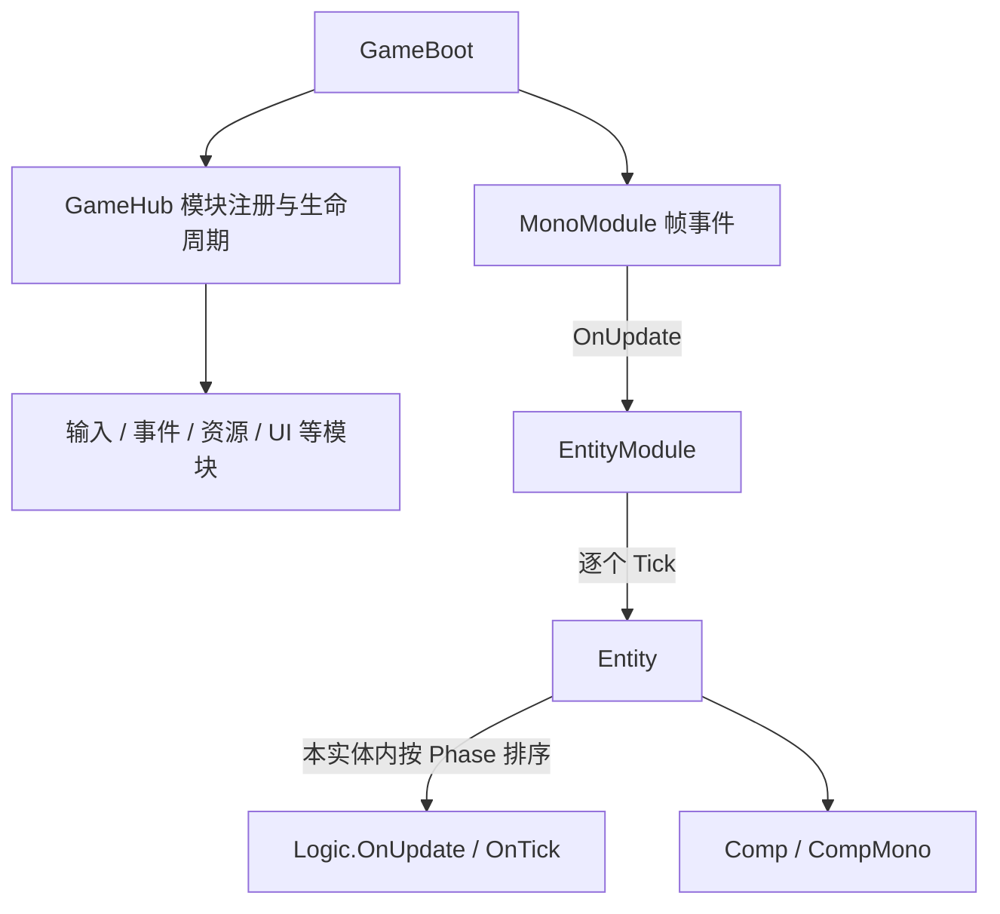

# BorFramework 框架现状与开发记录

记录日期：2026-09-12。

本文用于后续开发时快速恢复项目上下文，记录当前实现、使用边界和待完善事项。项目目标以用户最新说明为准，技术现状依据工作区中的代码和配置；本次没有执行 Unity 编译、Play Mode 或打包验证。“已实现”表示代码中已有对应逻辑，不代表已经通过运行验收。

## 1. 项目定位与技术基线

当前重点是建设自己的游戏开发框架 `BorFramework`，具体做什么游戏尚未确定。游戏类型、玩法、视角、美术风格及是否联机都不作为已确认需求；`Arcane-Crucible` 目前仅用于指代工作区项目名称。

现有 [ArtStyleGuide.md](ArtStyleGuide.md) 和 Demo 素材只能作为已有参考内容，不能据此认定游戏已经立项，也不能推导出框架必须实现的玩法功能。这一点依据用户在 2026-09-12 的明确说明。

框架当前已有模块管理、统一帧驱动、实体/逻辑/组件基础、事件、输入、资源加载和 UI 导航骨架；场景、配置、存档模块仍为占位。后续围绕已明确的框架需求逐步完善，具体游戏需求确定后再接入相应业务。

| 项目 | 当前版本 / 来源 |
| --- | --- |
| Unity Editor | `6000.6.0f1`，见 `ProjectSettings/ProjectVersion.txt` |
| URP | `17.7.0`，见 `Packages/manifest.json` |
| Input System | `1.20.0`，见 `Packages/manifest.json` |
| YooAsset | `3.0.5`，本地包 `Packages/com.tuyoogame.yooasset` |
| UniTask | `2.5.11`，源码位于 `Assets/Plugins/UniTask` |
| AI Navigation / uGUI | `2.0.14` / `2.6.0`，已在包清单中声明，不等于业务已接入 |
| Unity Test Framework | `1.8.0`；本次未发现自有框架测试程序集或测试脚本 |

`BorFramework.asmdef` 当前引用 Input System、YooAsset、UniTask。`Assets/Plugins` 还包含 DOTween、Sirenix、ConsolePro、Grid Master 等第三方内容。后续处理 API 问题，应以本地实际版本为准。

## 2. 目录与阅读入口

```text
Assets/
├── Doc/                         开发记录、美术规范
├── Scripts/BorFramework/
│   ├── 1_Core/
│   │   ├── Singleton/           普通单例、MonoBehaviour 单例
│   │   ├── Hub/                 模块容器和生命周期接口
│   │   ├── ELC/                 Entity、Logic、Component 基础
│   │   └── FSM/                 状态机基础
│   ├── 2_Module/                各功能模块及接口
│   ├── 3_Boot/GameBoot.cs       自动启动入口和 Unity 帧回调
│   └── BorFramework.asmdef
├── Resources/                   默认输入资产、第三方运行配置
├── GameAsset/Demo/              示例场景、角色和敌人贴图
└── BundleCollectorSetting.asset YooAsset 资源收集配置
```

当前构建场景是 `Assets/GameAsset/Demo/Scenes/SampleScene.unity`。静态场景文件包含相机、方向光、Global Volume 和 Plane，尚未形成框架使用示例；`GameBoot` 由代码自动创建。

建议阅读顺序：[GameBoot](../Scripts/BorFramework/3_Boot/GameBoot.cs) → [GameHub](../Scripts/BorFramework/1_Core/Hub/GameHub.cs) → [EntityModule](../Scripts/BorFramework/2_Module/EntityModule/EntityModule.cs) / [Entity](../Scripts/BorFramework/1_Core/ELC/Entity/Entity.cs) → [ResourceModule](../Scripts/BorFramework/2_Module/ResourceModule/ResourceModule.cs) → [UIModule](../Scripts/BorFramework/2_Module/UIModule/UIModule.cs)。

## 3. 启动与驱动关系

1. `GameBoot.CreateAutomatically` 在场景加载前创建持久化的 `GameBoot` 对象。
2. `Awake` 调用 `GameHub.Init`，创建模块容器，然后按接口类型登记模块。
3. 模块按注册顺序执行 `Init`，再按同一顺序执行 `Start`；所有 `Start` 返回后，`GameHub.IsRunning` 设为 `true`。
4. `GameBoot.Start` 发布一次 `FrameworkReadyEvent`。
5. Unity 的 FixedUpdate / Update / LateUpdate 经由 `MonoModule` 广播；当前 `EntityModule` 仅订阅 Update。
6. `GameBoot.OnDestroy` 调用 `StopModules`、`DisposeModules`，两者均按注册顺序的逆序执行。

当前注册顺序：

```text
Log → Mono → Event → Input → Entity → Resource → Save → Config → Scene → UI
```



注意两个状态的含义：`GameHub.IsInitialized` 只表示容器已经建立；`IsRunning` 表示模块的同步 `Start` 调用已经完成。`ResourceModule.Init` 会启动异步初始化，因此 **`FrameworkReadyEvent` 不保证资源已经 Ready**。该事件同步发布、不保存历史，晚订阅者不会补收到。

## 4. 各模块的实现程度

| 模块 | 当前已有能力 | 当前范围 / 缺口 |
| --- | --- | --- |
| Log | `Log`、`Waring`、`Error` 转发 Unity 日志 | 简单封装；部分模块直接调用 `Debug`，未统一经过接口 |
| Mono | FixedUpdate、Update、LateUpdate 的委托广播，释放时清空监听 | 由 GameBoot 驱动；固定帧事件现名为 `OnFixUpdate` |
| Event | 按事件类型订阅、取消订阅、同步发布；事件约束为 `struct, IEvent` | 订阅者需要管理解绑时机；无事件缓存和补发 |
| Input | 按 Action 名缓存查找，读取 Vector2、float 和按键状态 | 整份输入资产统一启停；无模块级 Action Map 切换、改键或玩家设备分配接口 |
| Entity | 登记/移除实体，逐帧驱动逻辑，移除和模块释放时调用实体 Dispose | 生命周期责任尚需明确；`AddEntity` 中 `_started` 分支为空 |
| Resource | 初始化包、获取版本、加载清单、同步/异步资源加载、资源租约 | 编辑器模拟 / 播放器离线模式；没有远端更新和重试入口 |
| UI | 按类型登记元素、Screen 栈、Screen 所属 Window 栈、Back、生命周期回调、层级根节点 | 尚未接入真实视图加载和渲染；Async 接口目前直接返回已完成的 UniTask |
| Scene | 模块接口和四个生命周期方法 | 空壳，尚无场景加载/切换接口 |
| Config | 模块接口和四个生命周期方法 | 空壳，尚无配置加载/查询接口 |
| Save | 模块接口和四个生命周期方法 | 空壳，尚无保存/读取接口 |

模块中的空生命周期方法不一定表示缺陷，例如 Event 和 Mono 当前可以无需初始化操作。Scene、Config、Save 被标记为空壳，是因为它们还没有对应的功能接口与实现。

## 5. 已有设计的使用约定

### 5.1 模块与类型登记

`GameHub` 以登记时的泛型类型为键，例如启动器登记的是 `IResourceModule`，使用方应通过 `GetModule<IResourceModule>()` 获取。它不会自动按照所有接口或基类匹配对象，同类型重复登记也不会替换已有实例。

目前由 `GameBoot` 保证 `Init → Register → InitModules → StartModules → StopModules → DisposeModules` 的顺序。直接调用 Hub 或模块时，需要遵循现有顺序；不要把这些方法视为都具备独立的重复调用保护。

### 5.2 Entity、Logic、Component 与 FSM

- `Entity` 持有组件、逻辑和可选的 GameObject 引用；组件/逻辑同样按登记时的泛型类型查找。
- `Comp` 是普通 C# 组件基类，`CompMono` 是 Unity 组件基类，二者都提供 `IComp.Entity` 属性。`Entity.AddComp` 当前只登记组件，不自动绑定这个属性。
- 逻辑阶段为 `Input → Command → Navigation → Movement → Targeting → Combat → StatusEffect → Cleanup → Presentation`，默认是 Command。排序只发生在单个实体内部，相同 Phase 没有额外顺序约定；当前不是所有实体按统一阶段交错执行。
- `Logic.OnUpdate` 在首次未阻塞更新时调用 `OnStart`，随后调用 `OnTick`。`Block/UnBlock` 使用计数；运行中的逻辑在后续更新观察到阻塞时调用 `OnStop`，完全解除阻塞后再次启动。
- `Entity.Dispose` 当前逆序释放逻辑，但不清理组件字典、解绑组件或销毁 `Go`。`EntityModule.Stop` 只停止帧订阅，不逐个调用逻辑的 `OnStop`。具体实体的收尾责任尚待明确。
- `StateMachine` 已支持按类型登记状态、切换、Update、Stop、Clear。需要业务自行驱动，尚未自动接入 Entity 或 MonoModule。

当前 `Assets/Scripts` 中尚未看到具体 Entity、Logic、State 派生类及其业务使用示例，因此这些基础约定还需要通过一个实际实体验证。

### 5.3 输入

默认输入资产是 `Assets/Resources/Input/DefultInputSystem.inputactions`，GameBoot 使用 Unity `Resources.Load` 的路径 `Input/DefultInputSystem` 加载。它包含 Player 和 UI 两个 Action Map，Player 中有 Move、Look、Attack、Interact、Crouch、Jump、Previous、Next、Sprint。

`InputModule.Start/Stop` 会启用/禁用整份资产。找不到 Action 时返回零值或 false，并缓存查找结果。`DefultInputSystem.cs` 是 Input System 1.20.0 生成的代码，后续应通过输入资产和生成流程调整。

### 5.4 资源与租约

`ResourceModule` 默认使用 `DefaultPackage`。初始化状态是 `None → Initializing → Ready / Failed`，释放后变为 `Disposed`。编辑器使用模拟构建文件系统，播放器使用离线内置文件系统，然后依次初始化包、请求版本、加载清单。

同步加载要求已经 Ready；异步加载会先等待初始化。成功返回的 `IAssetLease<T>` 持有 YooAsset 句柄，调用方在不再使用资源时负责调用 `Dispose`。不要只保存 `Asset` 而丢失租约，也不要在仍有实例依赖资源时提前释放。租约支持重复释放检查，但模块整体 Dispose 会销毁资源包和 YooAssets，仍持有的租约不能当作继续有效的保证。

当前收集配置只包含 `Assets/Resources`，使用 `AddressByFileName` 和 `PackDirectory`，开启无扩展名寻址。`Assets/GameAsset/Demo` 尚未加入收集路径。Unity Resources 路径与 YooAsset 地址是两套规则，不能直接把 `Input/DefultInputSystem` 当作 YooAsset 地址使用。

租约释放是引用生命周期的一部分，不等同于立即卸载 Bundle。本地 YooAsset 3.0.5 的自动卸载选项默认关闭，当前模块未开启该选项，也没有调用未使用资源卸载接口；常规资源回收策略需要结合后续使用场景确定。

### 5.5 UI

`UIRoot` 创建 World、Screen、Window、Popup、GlobalOverlay 五层，每层三个子层。现在创建的是普通 GameObject / Transform，并没有建立 Canvas、RectTransform 或完整的 UI 渲染与交互配置；仅凭这些层节点不能认为已完成 uGUI 接入。

Screen 入栈会通知旧 Screen 暂停，出栈会通知前一个恢复；Window 归属当前 Screen。`Back` 优先关闭当前 Screen 的栈顶 Window，否则弹出 Screen。每个登记类型目前只有一个元素实例，`Close` 对 Screen / Window 只处理相应栈顶。

`IUIElement` 的 `Id` 和 `Layer` 尚未用于资源查找或自动挂接层级。显示、隐藏和销毁视图目前依赖具体元素的回调实现。`WorldUIElementBase` 只保存 Target 和 Offset，独立于导航栈，还没有自动跟随、创建和回收流程。

## 6. 优先核对的边界

以下来自静态代码阅读，尚未在 Play Mode 中复现或验收。它们是后续验证入口，不是本次已经修复的问题。

| 优先事项 | 代码依据与可能影响 | 建议验证方式 |
| --- | --- | --- |
| 资源初始化任务被重复等待 | `ResourceModule.Init` 缓存原始 UniTask；每次 `LoadAssetAsync` 都会再次 await，包括 Ready 之后。初始化实际异步挂起时，并发或后续调用可能复用不可重复等待的任务 | 同时发起两次加载，再在初始化完成后连续加载；确认每个调用均正常完成 |
| 启动事件与资源状态不同步 | `GameBoot.Start` 发布 Ready 事件时不等待 Resource 状态 | 在事件回调中观察资源状态，验证首次同步/异步加载以及初始化失败时的表现 |
| 实体更新中的增删和释放 | `EntityModule.OnUpdate` 直接遍历实体列表；`Entity.Tick` foreach 遍历逻辑，`RemoveEntity` 会立即 Dispose | 验证逻辑中移除自身、移除其他实体、新增实体时，是否跳帧或修改正在遍历的集合 |
| 实体生命周期责任待明确 | `AddComp` 不绑定归属；`Entity.Dispose` 仅释放逻辑；模块 Stop 不通知逻辑 OnStop | 用一个真实 Entity 明确输入解绑、组件解绑、视图销毁分别由谁负责，并验证停止/重启/移除 |
| UI 打开结果和登记类型 | `OpenAsync<T>` 忽略 `OpenScreen/OpenWindow` 的 bool 返回值；登记按 typeof(T)，打开状态按实际类型记录 | 验证无 Screen 时打开 Window 的返回值，以及通过基类/接口登记时的 IsOpen/Destroy 行为 |
| 资源发布与回收流程 | 当前只有 Resources 收集器和播放器离线初始化；租约释放未配合常规 Bundle 回收 | 验证所需资源的地址、打包和内置文件；在实际播放器中完成加载、使用、释放和退出 |

重复等待风险已对照本地 UniTask 源码：`Runtime/UniTaskCompletionSource.cs` 的 continuation/token 检查，以及 `Runtime/CompilerServices/StateMachineRunner.cs` 的 GetResult 后回收逻辑。路径均相对 `Assets/Plugins/UniTask`。后续修复应在项目封装层进行。

## 7. 建议的后续推进顺序

这部分是基于当前代码的框架验证建议，尚未作为功能排期确认，不预设具体游戏方向。

1. **先跑通启动和资源加载。** 明确 Ready 的含义，验证并发/重复加载、失败反馈及租约释放；建立一个在编辑器和播放器都能加载的资源示例。
2. **接入一个最小实体示例。** 使用已有 Entity、Comp、Logic 完成一个测试实体，验证阶段顺序、阻塞/恢复、移除和清理。由实际使用决定是否需要固定帧逻辑。
3. **接入一个真实界面。** 沿用现有 Screen / Window 栈，补齐视图加载、挂层、打开、返回和销毁，让 UI 与资源模块形成完整使用流程。
4. **按明确需求补 Scene、Config、Save。** 为实际需要的模块建立最小使用示例，再根据新增需求扩展。具体游戏业务能力等方向确定后再讨论，不从既有文档或素材推定需求。

目前不需要为了“框架完整”预先增加通用依赖注入、复杂调度器或通用持久化系统。已有简单实现能满足需求时，继续沿用。

## 8. 后续协作约定

- 用户尚未确定做什么游戏。后续分析以用户明确需求和代码事实为依据，不把既有美术文档、Demo 素材或项目名称当成已确定的游戏定位。
- 修改前阅读相关源码和 [AGENTS.md](../../AGENTS.md)，沿用 `BorFramework` 命名、`1_Core / 2_Module / 3_Boot` 目录及现有接口方式。
- 项目自有代码不新增 `try / catch / finally`，不使用 `throw` 处理正常业务流程；优先空值检查、bool、Try 风格接口、状态枚举、提前返回和必要日志。
- 不手改输入生成代码，不擅自修改 YooAsset、UniTask 等第三方源码、依赖版本或 Package 配置。
- 当前工作区已有大量未提交改动，后续任务应先看 Git 状态，保留与任务无关的内容。
- 本记录随实现变化更新，优先维护“各模块的实现程度”和“优先核对的边界”，并写明实际验证结果。
